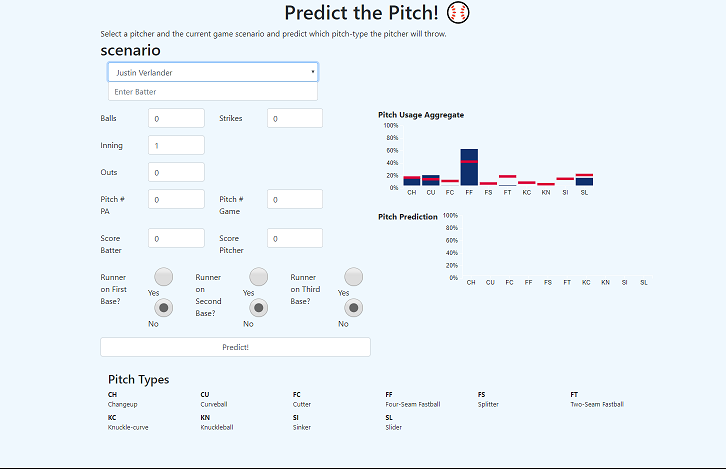

# **Group Project - Baseball Pitch Prediction**


Baseball Pitch Prediction is an app used to predict the type of pitch that will be thrown based on variables that the user can specify.

## **Usage**

```
Clone or download repo.

Specify the pitcher to predict with, then choose the various parameters, and finally click 'Predict!'
```

## **Setup**

Use the package manager [pip](https://pip.pypa.io/en/stable/) to install libraries.

```bash
pip install -r requirements.txt
```

### **Download our Data**

```
Download https://s3.amazonaws.com/philly6242/Modeling_data.zip
```
Extract Modeling_data.csv to the base directory for this application, the same directory where main.py is located


### **(OPTIONAL) Get Data**

#### [Tools](https://github.com/Jadams29/Georgia-Tech/tree/master/CSE%206242%20-%20Data%20%26%20Visual%20Analytics/Group%20Project/tools)

**Run Data_Orchestrator.py and specify the years you want game data for. This will generate .csv files corresponding to the years requested.**

```
> python Data_Orchestrator.py
```
**Enter the year you would like to start gathering data at**
```
Which year would you like to start gathering game schedules for? (eg. 2015)
>2015
```
**Enter the year you would like to stop gathering data at**
```
Which year would you like to stop gathering game schedules for? (eg. 2019)
>2019
```
**This is asking if you are wanting to get the game schedules**
```
We will begin gathering game schedules starting from year 2015 and until, but not including 2019.

Do you want to get the game schedules? (eg. Yes No)
>Yes
```
**This is asking if you only want the game schedules**
```
Do you want to get just game schedules? (eg. Yes or No)
>No
```
**This will take some time depending on how many years of data you are attempting to get**


```python
# Load previous CSV data
#   2018BaseballGames.csv
game_csv = "2008-2018_Baseball_Games.csv"
```

**If needed you can use CombineCSV.py to combine csv files if needed.**

Change the filename for your model inside baseballNetworkCreation.py
```python
players = pd.read_csv("player_lookup.csv")
data = pd.read_csv("Modeling_data.csv")
```

**Currently expects the following parameters:**

id, balls, strikes, inning, outs, pitch_PA, pitch_game, score_batter, score_pitcher


## **License**
[](https://github.com/Microsoft/BosqueLanguage/blob/master/LICENSE.txt)
[](#contribute)
